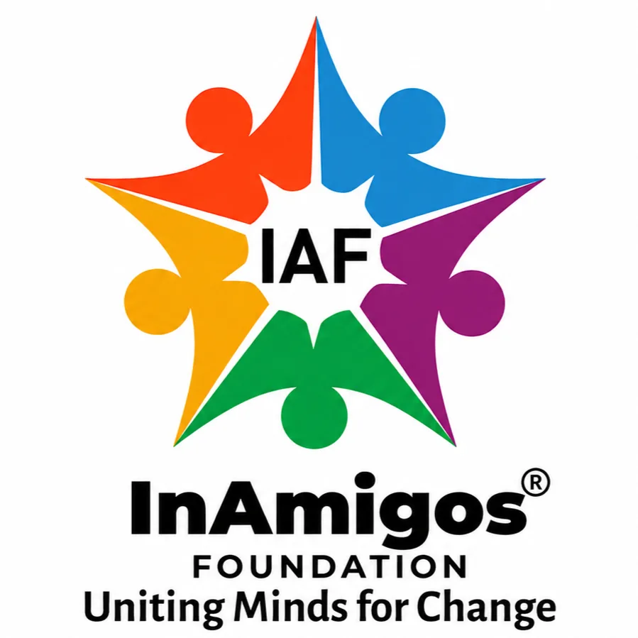

# InAmigos Foundation - Empowering Lives, Spreading Compassion 🌍

  

 

Welcome to the repository for the **InAmigos Foundation** website. This platform is designed to serve the community, boost engagement, and provide complete transparency into our NGO operations.

> **🎓 Internship Project Context:** 
> This web platform was designed, developed, and optimized as an internship project by **[Aniket Kumar Sinha](https://www.linkedin.com/in/aniketsinha-dev)** for the InAmigos Foundation. The primary objective was to modernize the foundation's digital footprint by engineering a highly performant, accessible, and deeply SEO-optimized website to maximize their community outreach.

## 🌟 About Us
**InAmigos Foundation** is a Section 8 registered non-profit organization founded on September 23, 2020. Our operations span across 28 states in India, focusing on providing essential support to the underprivileged. 

We operate through six primary flagship projects:
- 🍲 **Project Seva:** Food and clothing distribution.
- 📚 **Project Bachpanshala:** Child education and mentorship.
- 🐾 **Project Jeev:** Animal rescue, welfare, and rehabilitation.
- 🌸 **Project Udaan:** Women empowerment and financial independence.
- 🌱 **Project Prakriti:** Environmental conservation and plantation.
- 💼 **Project Vikas:** Skill development and youth employability.

## 🚀 Technical Highlights & SEO
This repository is heavily optimized for fast rendering and search engine ranking:
- **Blazing Fast Performance:** 100% static HTML and CSS ensuring near-instant load times.
- **Advanced SEO:** Fully integrated technical SEO including JSON-LD Structured Data (`Organization`, `WebSite`, `FAQPage`), Open Graph tags, canonical URLs, and `hreflang` routing for international visibility.
- **Responsive Design:** Fluid, modern layout utilizing CSS Grid/Flexbox and glassmorphism design principles. Perfect on desktop, tablet, and mobile.
- **Web Accessibility (a11y):** Semantic HTML5 structures, comprehensive `aria-labels`, and optimized lazy-loaded images with descriptive `alt` and `title` tags for screen readers.

## 🛠 Tech Stack
- **Frontend Core:** HTML5 & CSS3
- **Typography & Icons:** Google Fonts (Inter, Poppins), FontAwesome 6

## 🤝 Get Involved
We believe that small actions multiplied can change lives.
- **Volunteer:** [Join our community of changemakers](https://forms.gle/AB4c1hLaDDmtrKGU7)
- **Donate:** [Support our mission securely via Razorpay](https://rzp.io/l/kWQ87HP)
- **Partner with us:** We are CSR-1 registered and welcome high-impact corporate social responsibility (CSR) partnerships.

## 📜 Certifications & Compliance
As an organization committed to absolute transparency, we hold the following credentials:
- **80G & 12A Certified:** Donations are tax-exempt under the Income Tax Act.
- **CSR-1 Registered:** Authorized for direct corporate partnerships.
- **NITI Aayog Listed.**
- **IAF ISO 9001:2015 Certified.**

## 📞 Contact Information
- **Email:** inamigosfoundation@gmail.com
- **Phone:** +91 626 730 9902
- **Headquarters:** Ward No. 5, Gram Post, Sipat Ujwal Nagar, Bilaspur, Chhattisgarh 495555
- **Social Media:** 
  - [LinkedIn](https://www.linkedin.com/company/inamigos-foundation/)
  - [Instagram](https://www.instagram.com/inamigosfoundation/)
  - [Twitter](https://twitter.com/InamigosF)
  - [Facebook](https://www.facebook.com/inamigos.inamigos)

---
*Developed with ❤️ by [Aniket Kumar Sinha](https://www.linkedin.com/in/aniketsinha-dev)*
